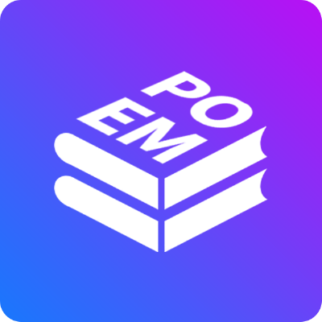

[//]: # (<div align="center">)

[//]: # ()
[//]: # (  <h1>Cole Leavitt - Rust Ecosystem Developer</h1>)

[//]: # ()
[//]: # (  <p>Full-Stack Developer | Security Analyst | Systems Programmer | Blockchain Enthusiast</p>)

[//]: # ()
[//]: # (</div>)

<div style="display: flex; align-items: center; margin-bottom: 20px;">
  <!-- Image Section -->
  

  <!-- Main Content Section -->
  <div style="flex-grow: 1;">
    <h1>Cole Leavitt - Rust Ecosystem Developer</h1>
    <p>Full-Stack Developer | Security Analyst | Systems Programmer | Blockchain Enthusiast</p>
    <!-- Inline Contact Info -->
    <p style="margin-top: 10px; display: flex; align-items: center; gap: 15px;">
      <!-- GitHub Icon -->
      <a href="https://github.com/coleleavitt" target="_blank" style="display: flex; align-items: center; text-decoration: none;">
        
      </a>
      <!-- LinkedIn Icon -->
      <a href="https://linkedin.com/in/coleleavitt" target="_blank" style="display: flex; align-items: center; text-decoration: none;">
        
      </a>
      <!-- Email Icon -->
      <a href="mailto:cole@unwrap.rs" style="display: flex; align-items: center; text-decoration: none;">
        
      </a>
    </p>
    <h3>Want to know things about me?</h3>
    <ul>
      <li>I’m a curious and adventurous character.</li>
      <li>I enjoy exploring mysterious worlds.</li>
      <li>Always experimenting with science and survival skills.</li>
    </ul>
  </div>
</div>


## Languages & Frameworks

<div style="display: flex; flex-wrap: wrap; gap: 15px; justify-content: left; align-items: center;">
  <!-- Languages and Frameworks -->
  
  
  
  
  
  
  
  
  
  
  
  
  
  

</div>

## Tools
<div style="display: flex; flex-wrap: wrap; gap: 15px; justify-content: left; align-items: center;">
    
    
    
    
    
    
    
</div>

## Databases
<div style="display: flex; flex-wrap: wrap; gap: 15px; justify-content: left; align-items: center;">
    
    
</div>


## Infrastructure
<div style="display: flex; flex-wrap: wrap; gap: 15px; justify-content: left; align-items: center;">
    
    
    
    
    
    
    
    
    
    
</div>


```yaml
my_system:
  kernel:
    version: "6.12.16-gentoo-gentoo-dist"
    architecture: "x86_64"
    bits: 64
    compiler:
      name: "gcc"
      version: "14.2.1"
    arch: "x86_64"
  desktop:
    name: "niri"
    version: "N/A"
  distribution:
    name: "Gentoo"
    base_system_release: "2.17"
  hardware:
    cpu: Intel Core i9-12900HX
    graphics:
      integrated: Intel UHD Graphics 770
      discrete: NVIDIA RTX A4500
    laptop_model: ThinkPad P16 Gen 1
 ```

[//]: # (## Let's Connect)

[//]: # ()
[//]: # (- GitHub: [@coleleavitt]&#40;https://github.com/coleleavitt&#41;)

[//]: # (- LinkedIn: [Professional Profile]&#40;https://linkedin.com/in/coleleavitt&#41;)

[//]: # (- Email: [cole@unwrap.rs]&#40;mailto:cole@unwrap.rs&#41;)

[//]: # ()
[//]: # ([![Open Source Love]&#40;https://badges.frapsoft.com/os/v2/open-source.svg?v=103&#41;]&#40;https://github.com/coleleavitt&#41;)
